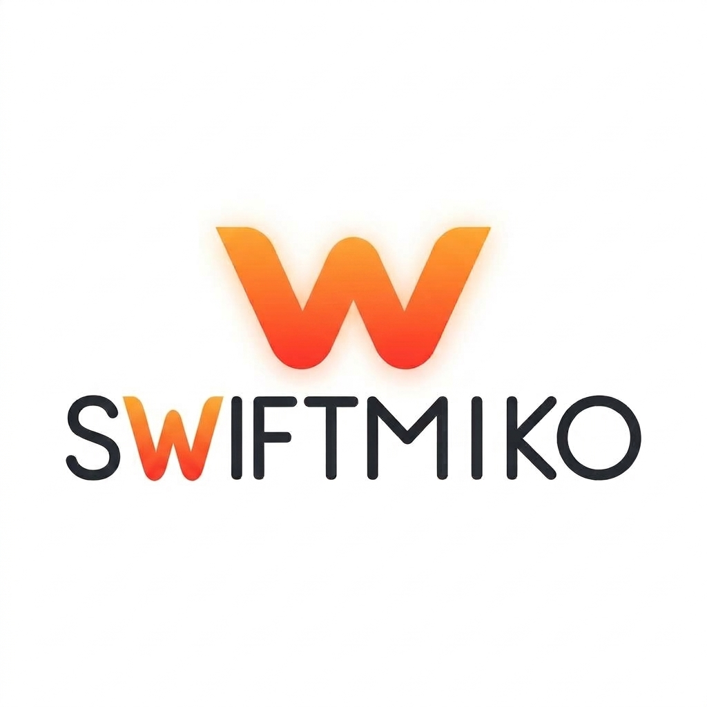

<p align="center">
  
</p>

Swiftmiko Examples
=======

A set of common Swiftmiko use cases, translated from
[Netmiko's own examples](https://github.com/ktbyers/netmiko/blob/develop/EXAMPLES.md)
into Swift. See also the runnable SwiftUI apps under `Examples/` in
this repo for complete, larger programs.

<br />

## Table of contents

#### Available Device Types
- [Available device types](#available-device-types-1)
#### Simple Examples
- [Simple example](#simple-example)
- [Enable mode](#enable-mode)

#### Multiple Devices (simple example)
- [Connecting to multiple devices](#connecting-to-multiple-devices)

#### Show Commands
- [Executing a show command](#executing-a-show-command)
- [Handling commands that prompt (timing)](#handling-commands-that-prompt-timing)
- [Handling commands that prompt (expect string)](#handling-commands-that-prompt-expect-string)
- [Using globalDelayFactor](#using-globaldelayfactor)

#### Configuration Changes
- [Configuration changes](#configuration-changes-1)
- [Configuration changes from a file](#configuration-changes-from-a-file)

#### SSH keys
- [SSH keys](#ssh-keys)

#### Logging and Session Log
- [Session log](#session-log)
- [Standard logging](#standard-logging)

#### Secure Copy
- [Secure Copy](#secure-copy-1)

#### Auto Detection of Device Type
- [Auto detection using SSH](#auto-detection-using-ssh)
- [Auto detection using SNMPv2c](#auto-detection-using-snmpv2c)
- [Auto detection using SNMPv3](#auto-detection-using-snmpv3)

#### Terminal Server Example
- [Terminal server and redispatch](#terminal-server-and-redispatch)

#### Parsers
- [A note on TextFSM/Genie/TTP](#a-note-on-textfsmgenietp)

<br />

## Available device types

`ConnectionProfile.deviceType` accepts any string registered with
`SSHDispatcher`. Passing an unregistered one raises
`SwiftmikoError.connectionFailed` listing every currently supported
type:

```swift
import Swiftmiko

let profile = ConnectionProfile(
    host: "cisco1.lasthop.io",
    deviceType: "invalid",
    username: "pyclass",
    auth: .password("invalid")
)

do {
    _ = try await SSHDispatcher.connectHandler(profile: profile)
} catch {
    print(error)
    // Unsupported device type 'invalid'. Currently supported platforms are:
    // a10
    // accedian
    // adtran_os
    // ...
}
```

You can also list them directly without attempting a connection:

```swift
print(SSHDispatcher.platforms)       // every registered SSH/Telnet/serial deviceType
print(SSHDispatcher.scpPlatforms)    // every deviceType with SCP support
```

`SSHDispatcher.defaultConnectionFactories` (`Sources/SSHDispatcher.swift`)
registers essentially every vendor driver ported under `Sources/` — see
`PLATFORMS.md` for the full platform list and current per-platform
testing status. A handful of `deviceType` strings that appear in
Netmiko but have no Swift driver ported yet (e.g. `huawei_olt`,
`fiberstore_fsosv2`) are intentionally left unregistered rather than
guessed at; if you hit one of those, port the driver first (see
`VENDOR.md`) or register a stand-in yourself:

```swift
await DispatcherRegistry.shared.registerConnection("some_new_device") {
    SomeDriverSSH(profile: $0, channelProvider: nioSSHChannelProvider)
}
```

A registration made this way takes priority over anything in
`defaultConnectionFactories`, so it also works to override an existing
entry (e.g. swap in your own driver for testing) without touching
`SSHDispatcher.swift`.

<br />

## Simple example

```swift
import Swiftmiko

let profile = ConnectionProfile(
    host: "cisco1.lasthop.io",
    deviceType: "cisco_ios",
    username: "pyclass",
    auth: .password(readSecurely("Password: "))
)

let connection = try await SSHDispatcher.connectHandler(profile: profile)
print(try await connection.findPrompt())
await connection.disconnect()
```

`readSecurely` here is a stand-in for however your program prompts
for credentials — Swiftmiko's own CLI tools use a small
`termios`-based helper (`promptSecure` in
`Sources/CLITools/CommonOptions.swift`) to read a password without
echoing it.

<br />

## Enable mode

```swift
import Swiftmiko

let profile = ConnectionProfile(
    host: "cisco1.lasthop.io",
    deviceType: "cisco_ios",
    username: "pyclass",
    auth: .password(readSecurely("Password: ")),
    secret: readSecurely("Enter secret: ")
)

let connection = try await SSHDispatcher.connectHandler(profile: profile)
try await connection.enterEnableMode(secret: profile.secret ?? "")
print(try await connection.findPrompt())
await connection.disconnect()
```

<br />

## Connecting to multiple devices

```swift
import Swiftmiko

let password = readSecurely("Password: ")

let profiles = [
    ConnectionProfile(host: "cisco1.lasthop.io", deviceType: "cisco_ios", username: "pyclass", auth: .password(password)),
    ConnectionProfile(host: "cisco2.lasthop.io", deviceType: "cisco_ios", username: "pyclass", auth: .password(password)),
    ConnectionProfile(host: "nxos1.lasthop.io", deviceType: "cisco_nxos", username: "pyclass", auth: .password(password)),
]

for profile in profiles {
    let connection = try await SSHDispatcher.connectHandler(profile: profile)
    print(try await connection.findPrompt())
    await connection.disconnect()
}
```

Each connection is fully independent — there's no shared session
state, so this loop is a natural place to reach for `TaskGroup` if
you want the devices contacted concurrently rather than one at a
time.

<br />

## Executing a show command

```swift
import Swiftmiko

let profile = ConnectionProfile(
    host: "cisco1.lasthop.io",
    deviceType: "cisco_ios",
    username: "pyclass",
    auth: .password(readSecurely("Password: "))
)

let connection = try await SSHDispatcher.connectHandler(profile: profile)
// sendCommand automatically strips the command echo and trailing prompt.
let output = try await connection.sendCommand("show ip int brief")
await connection.disconnect()

print()
print(output)
print()
```

#### Output from the above execution:

```
Interface                  IP-Address      OK? Method Status                Protocol
FastEthernet0              unassigned      YES unset  down                  down
FastEthernet1              unassigned      YES unset  down                  down
FastEthernet4              10.220.88.20    YES NVRAM  up                    up
Vlan1                      unassigned      YES unset  down                  down
```

<br />

## Handling commands that prompt (timing)

Some commands prompt for more input mid-command. `sendCommandTiming`
is entirely delay-based (it doesn't wait for a prompt match), which
makes it the right tool for these interactions — the same role
`send_command_timing()` plays in Netmiko:

```
cisco1#delete flash:/test3.txt
Delete filename [test3.txt]?
Delete flash:/test3.txt? [confirm]y
```

```swift
let profile = ConnectionProfile(
    host: "cisco1.lasthop.io", deviceType: "cisco_ios",
    username: "pyclass", auth: .password(readSecurely("Password: "))
)
let connection = try await SSHDispatcher.connectHandler(profile: profile)

var output = try await connection.sendCommandTiming(
    "delete flash:/test3.txt",
    stripPrompt: false,
    stripCommand: false
)
if output.contains("Delete filename") {
    output += try await connection.sendCommandTiming(
        "\n", stripPrompt: false, stripCommand: false
    )
}
if output.contains("confirm") {
    output += try await connection.sendCommandTiming(
        "y", stripPrompt: false, stripCommand: false
    )
}
await connection.disconnect()

print(output)
```

<br />

## Handling commands that prompt (expect string)

The same interaction, using `sendCommand`'s `expectString` parameter
(a regex Swiftmiko waits for instead of the connection's normal
prompt pattern) rather than a fixed delay:

```swift
let profile = ConnectionProfile(
    host: "cisco1.lasthop.io", deviceType: "cisco_ios",
    username: "pyclass", auth: .password(readSecurely("Password: "))
)
let connection = try await SSHDispatcher.connectHandler(profile: profile)

var output = try await connection.sendCommand(
    "delete flash:/test4.txt",
    expectString: "Delete filename",
    stripPrompt: false,
    stripCommand: false
)
output += try await connection.sendCommand(
    "\n", expectString: "confirm", stripPrompt: false, stripCommand: false
)
output += try await connection.sendCommand(
    "y", expectString: "#", stripPrompt: false, stripCommand: false
)
await connection.disconnect()

print(output)
```

<br />

## Using globalDelayFactor

`ConnectionProfile.globalDelayFactor` scales every internal
settle-delay a driver requests, matching Netmiko's
`global_delay_factor`. Set it once on the profile rather than on each
call:

```swift
var profile = ConnectionProfile(
    host: "cisco1.lasthop.io",
    deviceType: "cisco_ios",
    username: "pyclass",
    auth: .password(readSecurely("Password: "))
)
// Doubles every internal delay this driver requests.
profile.globalDelayFactor = 2.0

let connection = try await SSHDispatcher.connectHandler(profile: profile)
let output = try await connection.sendCommand("show ip arp")
await connection.disconnect()

print(output)
```

Individual slow commands (e.g. a flash copy) can instead pass their
own `readTimeout` directly to `sendCommand`/`sendCommandTiming`
without touching the profile.

<br />

## Configuration changes

```swift
let profile = ConnectionProfile(
    host: "cisco1.lasthop.io", deviceType: "cisco_ios",
    username: "pyclass", auth: .password(readSecurely("Password: "))
)

// cisco_ios resolves to CiscoIOSSSH, a CiscoBaseConnection subclass —
// saveConfig() is declared there, one level below the generic BaseConnection.
let connection = try await SSHDispatcher.connectHandler(profile: profile) as! CiscoBaseConnection

var output = try await connection.sendConfigSet(["logging buffered 100000"])
// commit() for Cisco XR/Juniper Junos/Palo Alto is not yet ported (see
// PLATFORMS.md); saveConfig() covers everything else, e.g. Cisco IOS:
output += try await connection.saveConfig()
await connection.disconnect()

print(output)
```

`sendConfigSet` automatically enters and exits config mode.
`saveConfig` is declared on `CiscoBaseConnection`
(`Sources/CiscoBaseConnection.swift`), so the connection needs to be
that type or a subclass — which every Cisco-family driver is.

<br />

## Configuration changes from a file

Swiftmiko doesn't have a `send_config_from_file` convenience yet
(see the note in [`COMMON_ISSUES.md`](./COMMON_ISSUES.md)); read the
file into an array of commands yourself and pass it to
`sendConfigSet`:

```swift
import Foundation

// config_changes.txt:
// logging buffered 100000
// no logging console

let contents = try String(contentsOfFile: "config_changes.txt", encoding: .utf8)
let commands = contents
    .trimmingCharacters(in: .whitespacesAndNewlines)
    .components(separatedBy: .newlines)

let profile = ConnectionProfile(
    host: "cisco1.lasthop.io", deviceType: "cisco_ios",
    username: "pyclass", auth: .password(readSecurely("Password: "))
)

// cisco_ios resolves to CiscoIOSSSH, a CiscoBaseConnection subclass —
// saveConfig() is declared there, one level below the generic BaseConnection.
let connection = try await SSHDispatcher.connectHandler(profile: profile) as! CiscoBaseConnection
var output = try await connection.sendConfigSet(commands)
output += try await connection.saveConfig()
await connection.disconnect()

print(output)
```

<br />

## SSH keys

```swift
let profile = ConnectionProfile(
    host: "cisco1.lasthop.io",
    deviceType: "cisco_ios",
    username: "testuser",
    auth: .keyFile(path: "~/.ssh/test_rsa")
)

let connection = try await SSHDispatcher.connectHandler(profile: profile)
let output = try await connection.sendCommand("show ip arp")
await connection.disconnect()

print(output)
```

`AuthMethod.keyFile` also accepts a `passphrase:` for
passphrase-protected keys; `AuthMethod.sshAgent` defers to a running
SSH agent instead. There's currently no `ssh_config_file`-style
option — Swiftmiko talks to the transport directly rather than
shelling out to a system SSH client, so jump-host/proxy behavior
needs to be modeled explicitly on the profile rather than read from
an OpenSSH config file.

<br />

## Session log

`SSHDispatcher.connectHandler` doesn't take a session-log parameter,
so construct the concrete driver directly — `sessionLog:` is an
initializer parameter on `BaseConnection` that every driver inherits:

```swift
let profile = ConnectionProfile(
    host: "cisco1.lasthop.io",
    deviceType: "cisco_ios",
    username: "pyclass",
    auth: .password(readSecurely("Password: "))
)

let connection = CiscoIOSSSH(
    profile: profile,
    sessionLog: SessionLogConfig(filePath: "output.txt", recordWrites: true),
    channelProvider: nioSSHChannelProvider
)
try await connection.connect()
let output = try await connection.sendCommand("show ip int brief")
await connection.disconnect()
```

Passwords and secrets found on the profile are automatically
redacted in the log (see `BaseConnection.secretFilterValues`). Set
`recordWrites: false` (the default) to log only what's read back
from the device, not what was sent.

<br />

## Standard logging

Every `BaseConnection` carries a `SwiftmikoLogger` (see
`Sources/BaseConnection.swift`) that prints `TRACE`/`DEBUG`/`INFO`/`WARNING`
lines labeled with `logLabel`. Pass a custom label, or disable it
entirely, at construction time:

```swift
let profile = ConnectionProfile(
    host: "cisco1.lasthop.io", deviceType: "cisco_ios",
    username: "pyclass", auth: .password(readSecurely("Password: "))
)
let connection = CiscoIOSSSH(
    profile: profile,
    logLabel: "swiftmiko.cisco1",
    loggerEnabled: true,
    channelProvider: nioSSHChannelProvider
)
```

This is deliberately minimal compared to Netmiko's `logging`
integration — there's no handler/formatter configuration surface yet.
If you need structured logs, wrap `swift-log` around the connection
at the call site instead of relying on `SwiftmikoLogger`.

<br />

## Secure Copy

```swift
import Swiftmiko

let profile = ConnectionProfile(
    host: "cisco1.lasthop.io", deviceType: "cisco_ios",
    username: "pyclass", auth: .password(readSecurely("Password: "))
)
let connection = try await SSHDispatcher.connectHandler(profile: profile)

// A secure copy server must be enabled on the device
// ("ip scp server enable").
let result = try await fileTransfer(
    sshConnection: connection,
    sourceFile: "test1.txt",
    destinationFile: "test1.txt",
    fileSystem: "flash:",
    direction: .put,
    overwriteFile: true,
    scpClient: NIOSCPClient(profile: connection.profile)
)

print(result.dictionary)
// ["file_exists": false, "file_transferred": true, "file_verified": true]
```

`fileTransfer` is the direct equivalent of Netmiko's `file_transfer()`
free function (`Sources/SCPFunctions.swift`) — it checks whether the
destination already exists, verifies free space, transfers, and MD5-
verifies, all before you have to think about it. `NIOSCPClient` is
Swiftmiko's SwiftNIO-SSH-backed `SCPClient` implementation
(`Sources/NIOSCPClient.swift`); supply your own type conforming to
`SCPClient` if you need a different transport.

For direct control instead of the all-in-one helper, drive a
`FileTransfer` (`Sources/SCPHandler.swift`) yourself:

```swift
let transfer = try await FileTransfer(
    connection: connection,
    sourceFile: "test1.txt",
    destinationFile: "test1.txt",
    fileSystem: "flash:",
    direction: .put,
    scpClient: NIOSCPClient(profile: connection.profile)
)
try await transfer.establishSCPConnection()
try await transfer.transferFile()
let verified = try await transfer.verifyFile()
await transfer.closeSCPChannel()
```

<br />

## Auto detection using SSH

```swift
import Swiftmiko

var profile = ConnectionProfile(
    host: "cisco1.lasthop.io",
    // Any registered driver that connects and can run a command works
    // as the probe — SSHDetect only needs a live, authenticated
    // connection, it doesn't care whether the guess is later corrected.
    deviceType: "cisco_ios",
    username: "pyclass",
    auth: .password(readSecurely("Password: "))
)

let probe = try await SSHDispatcher.connectHandler(profile: profile)

let guesser = try await SSHDetect(connection: probe)
// autodetect() disconnects `probe` itself before returning, in every
// code path — don't call connection.disconnect() on it afterward.
let bestMatch = await guesser.autodetect()
print(bestMatch as Any)             // best-guess deviceType
print(guesser.potentialMatches)     // every rule that scored > 0, and its score

if let bestMatch {
    profile.deviceType = bestMatch
    let connection = try await SSHDispatcher.connectHandler(profile: profile)
    print(try await connection.findPrompt())
}
```

`SSHDetect` (`Sources/SSHAutodetect.swift`) runs the same
signature-matching approach as Netmiko's `SSHDetect` — a per-vendor
table of probe commands and regex search patterns
(`SSHAutodetectMapper.rules`), with results cached per command so a
shared probe command across vendors only runs once.

<br />

## Auto detection using SNMPv2c

```swift
import Swiftmiko

let community = readSecurely("Enter SNMP community: ")
let detector = try SNMPDetect(
    hostname: "cisco1.lasthop.io",
    snmpVersion: .v2c,
    community: community
)
guard let deviceType = try await detector.autodetect() else {
    fatalError("SNMP failed!")
}
print(deviceType)

var profile = ConnectionProfile(
    host: "cisco1.lasthop.io", deviceType: deviceType,
    username: "pyclass", auth: .password(readSecurely("Password: "))
)
let connection = try await SSHDispatcher.connectHandler(profile: profile)
print(try await connection.findPrompt())
await connection.disconnect()
```

<br />

## Auto detection using SNMPv3

```swift
import Swiftmiko

let key = readSecurely("Enter SNMPv3 auth/privacy key: ")
let detector = try SNMPDetect(
    hostname: "cisco1.lasthop.io",
    snmpVersion: .v3,
    user: "pysnmp",
    authenticationKey: key,
    privacyKey: key,
    authenticationProtocol: .sha,
    privacyProtocol: .aes128
)
guard let deviceType = try await detector.autodetect() else {
    fatalError("SNMP failed!")
}

var profile = ConnectionProfile(
    host: "cisco1.lasthop.io", deviceType: deviceType,
    username: "pyclass", auth: .password(readSecurely("Password: "))
)
let connection = try await SSHDispatcher.connectHandler(profile: profile)
print(try await connection.findPrompt())
await connection.disconnect()
```

`SNMPDetect` (`Sources/SNMPAutodetect.swift`) needs a `SNMPTransport`
implementation supplied to actually talk SNMP on the wire — Swiftmiko
doesn't bundle one, matching Netmiko's own dependency on the external
`pysnmp` package for this feature.

<br />

## Terminal server and redispatch

This mirrors Netmiko's own complicated example: bouncing through a
switch, into a terminal server over Telnet, then out a console port
to a third device — using `redispatch` to swap the active driver at
each hop.

Netmiko's `redispatch()` reassigns `obj.__class__` in place, which
keeps the same socket alive across the hop. Swift has no equivalent
to reassigning an object's class at runtime, so
`SSHDispatcher.redispatch(_:deviceType:sessionPreparation:)` instead
constructs a *new* driver instance for the target `deviceType` and
transplants the original connection's already-open channel onto it
(see `Sources/SSHDispatcher.swift`) — no reconnect, no
re-authentication, just a new Swift object wrapping the same socket.
That's the part of Netmiko's behavior that actually matters for this
pattern, so it works the same way in practice:

```swift
import Swiftmiko
import Foundation

let terminalServerIP = ProcessInfo.processInfo.environment["TERMINAL_SERVER_IP"]!
let publicIP = ProcessInfo.processInfo.environment["PUBLIC_IP"]!

// Bounce through a small switch to reach the terminal server.
var connection = try await SSHDispatcher.connectHandler(
    profile: ConnectionProfile(
        host: publicIP, deviceType: "cisco_s300",
        username: "admin", auth: .password(readSecurely("Enter password of s300: "))
    )
)
print(try await connection.findPrompt())

// Telnet to the terminal server from the switch's own CLI.
try await connection.writeChannel("telnet \(terminalServerIP)\n")
try await connection.telnetLogin()
print(try await connection.findPrompt())

// Made it to the terminal server; redispatch to the real driver for
// whatever's actually attached to it (here, a Cisco IOS device) —
// sessionPreparation: true (the default) runs disablePaging/setBasePrompt
// on the new driver, since we're now genuinely talking to an IOS CLI.
connection = try await SSHDispatcher.redispatch(connection, deviceType: "cisco_ios")
try await connection.enterEnableMode(secret: readSecurely("Enter enable secret: "))
print(try await connection.findPrompt())

// Now hop again to the end device via the terminal server (a Juniper SRX).
try await connection.writeChannel("srx2\n")
try await connection.telnetLogin()
connection = try await SSHDispatcher.redispatch(connection, deviceType: "juniper_junos")
print(try await connection.findPrompt())

// From here on `connection` is a real JuniperSSH instance — vendor-specific
// behavior (commit, Junos config mode, etc.) is fully available.
let output = try await connection.sendCommand("show version")
print(output)
await connection.disconnect()
```

Each call to `redispatch` returns a new connection object that now
owns the channel — don't keep using the connection you passed in
afterward. `TerminalServer`/`TerminalServerSSH`/`TerminalServerTelnet`
(`Sources/TerminalServer/TerminalServer.swift`) exist for the case
where the *first* hop itself has no real CLI to run session
preparation against — connect with `deviceType: "generic_termserver"`
(or its Telnet variant) instead of a real vendor driver for that
initial connection, then redispatch away from it once you've reached
something with an actual CLI.

<br />

## A note on TextFSM/Genie/TTP

Netmiko's `use_textfsm=`/`use_genie=`/`use_ttp=` structured-output
parsers have no Swift equivalent in this project yet — there is no
TextFSM/Genie/TTP template engine ported. `sendCommand` always
returns a plain `String`; parsing that into structured data is
currently left to the caller (regular expressions, or your own
`Codable`-driven parsing on top of the raw text).
